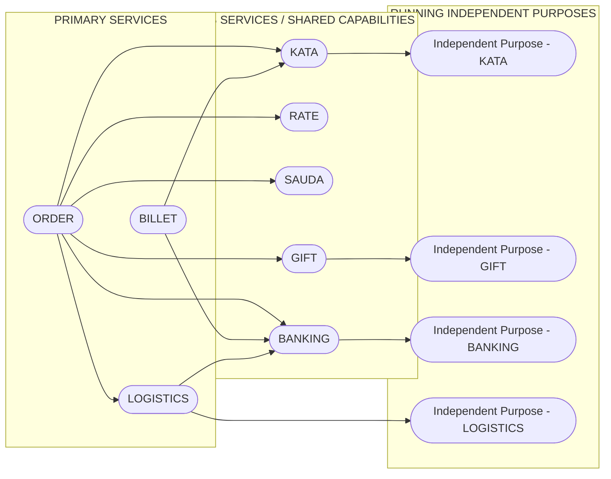

```mermaid
graph LR

%% ===== Primary Services =====
subgraph Primary_Services [PRIMARY SERVICES]
Order([ORDER])
Billet([BILLET])
Logistics([LOGISTICS])
end

%% ===== Sub Services / Shared Services =====
subgraph Sub_Services [SUB SERVICES / SHARED CAPABILITIES]
Kata([KATA])
Rate([RATE])
Sauda([SAUDA])
Gift([GIFT])
Banking([BANKING])
end

%% ===== Independent Purposes =====
subgraph Independent_Services [RUNNING INDEPENDENT PURPOSES]
Independent_Kata([Independent Purpose - KATA])
Independent_Gift([Independent Purpose - GIFT])
Independent_Banking([Independent Purpose - BANKING])
Independent_Logistics([Independent Purpose - LOGISTICS])
end

%% Dependencies
Order --> Kata
Order --> Sauda
Order --> Rate
Order --> Banking
Order --> Gift
Order --> Logistics

Billet --> Kata
Billet --> Banking

Logistics --> Banking

%% Independently running services
Kata --> Independent_Kata
Gift --> Independent_Gift
Banking --> Independent_Banking
Logistics --> Independent_Logistics
```
