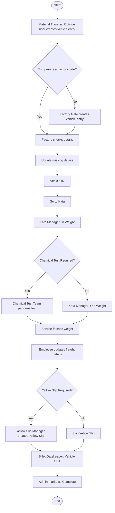

```mermaid

flowchart TD
  Start([Start]) --> ExtEntry[Material Transfer: Outside user creates vehicle entry]

  ExtEntry --> GateCheck{Entry exists at factory gate?}

  GateCheck -- No --> GateCreate[Factory Gate creates vehicle entry]

  GateCheck -- Yes --> CheckDetails[Factory checks details]

  GateCreate --> CheckDetails

  CheckDetails --> UpdateDetails[Update missing details]
  UpdateDetails --> VehicleIn[Vehicle IN]

  VehicleIn --> GoToKata[Go to Kata]
  GoToKata --> InWt[Kata Manager: In Weight]

  InWt --> ChemReq{Chemical Test Required?}

  ChemReq -- Yes --> ChemTest[Chemical Test Team performs test]
  ChemReq -- No --> OutWt[Kata Manager: Out Weight]

  ChemTest --> FetchWt[Service fetches weight]
  OutWt --> FetchWt[Service fetches weight]

  FetchWt --> FreightUpdate[Employee updates freight details]

  FreightUpdate --> YellowReq{Yellow Slip Required?}
  YellowReq -- Yes --> CreateYellow[Yellow Slip Manager creates Yellow Slip]
  YellowReq -- No --> SkipYellow[Skip Yellow Slip]

  CreateYellow --> VehicleOut[Billet Gatekeeper: Vehicle OUT]
  SkipYellow --> VehicleOut

  VehicleOut --> AdminComplete[Admin marks as Complete]
  AdminComplete --> End([End])


```
